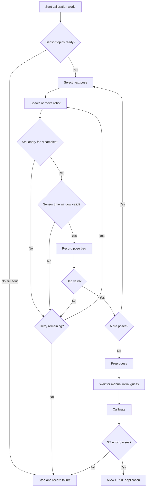

# Simulation PATCH-08: Behavior Tree 기반 Calibration Workflow 조정

- 작성일: 2026-08-06
- 브랜치: `main`
- 코드 기준: 상위 리포 `HEAD` 없음, `turtlebot3_simulations@45633014a14e8f438495b532a723e4ad45cbbd31`, `direct_visual_lidar_calibration@02a0dc039f5509708f384be4ff3228e0ae09352d`
- 대상: calibration pose 수집, rosbag 검증, 전처리·보정·평가 단계의 실행 조정
- 결론: **Behavior Tree는 보정 수학이나 저수준 속도 제어가 아니라, 반복 수집의 조건 확인·부분 재시도·실패 사유 기록에 적용한다.**

### Why?

현재 상위 리포에는 실행 가능한 calibration orchestrator가 없다. Simulation PATCH-02는 5개 pose마다 simulation을 다시 실행하고, 센서가 안정되기를 기다린 뒤, 작업자가 `ros2 bag record`를 시작·종료하는 절차를 정의한다. Simulation PATCH-03의 `check-calibration-bags.sh`와 `run-calibration.sh`, Simulation PATCH-04의 `extrinsic_math.py`도 아직 실제 파일이 아니라 보고서 안의 구현 계획이다.

이 흐름에서는 pose 하나의 센서가 끊기거나 bag이 불완전해도 실패가 전체 절차 중 어느 단계에서 발생했는지 기계적으로 남지 않는다. 작업자가 실패 pose와 재시작 지점을 직접 판단해야 하며, 이미 정상적으로 수집한 pose까지 다시 수행할 가능성이 있다.

또한 현재 upstream 전처리는 bag의 image 하나와 bag 전체의 LiDAR frame을 사용한다. 로봇과 장면이 정지했다는 가정에서는 유효하지만, 로봇 이동이나 동적 장애물이 존재하면 서로 다른 시간의 공간 관측을 합치게 된다. 따라서 기록 전에 정지 상태와 센서 시간 상태를 명시적으로 판정하고, 조건을 통과한 pose만 calibration 입력으로 승인할 실행 계층이 필요하다.

### 개념

| 개념 | 쉬운 설명 | 이 PATCH에서의 역할 |
|---|---|---|
| Behavior Tree | 작은 작업과 조건을 트리로 연결하고 각 노드가 `RUNNING`, `SUCCESS`, `FAILURE`를 반환하는 실행 구조 | pose 수집, 재시도, 작업자 대기, 평가 실패를 서로 다른 상태로 표현 |
| `Sequence` | 앞 단계가 성공해야 다음 단계로 진행 | 센서 확인 → 정지 확인 → 기록 → bag 검증 순서를 보장 |
| `Fallback` | 앞 선택지가 실패하면 다음 복구 방법 실행 | bag 재수집, initial guess 재입력, 안전 종료 선택 |
| `Retry` | 동일 작업을 정해진 횟수까지만 다시 실행 | 무한 재시작을 막고 실패 pose만 제한적으로 재수집 |
| Blackboard | tree node가 공유하는 작은 상태 저장소 | `pose_id`, sensor stamp, bag 경로, retry 횟수, 평가 오차 기록 |

### What I Made

이 PATCH는 구현 코드가 아니라 다음 구현 단계에서 사용할 Behavior Tree 적용 경계와 완료 조건을 정의한다. 먼저 Simulation PATCH-00부터 Simulation PATCH-04의 실제 실행 파일을 만든 뒤 이 설계를 적용한다.

#### 적용할 전체 흐름

#### Behavior Tree node별 적용 지점

| BT node | 입력 | 성공 조건 | 실패·복구 |
|---|---|---|---|
| `SensorsReady` | `/calib/points`, `/camera/image_raw`, `/camera/camera_info`, `/tf`, `/clock` | 필수 topic 존재, message가 갱신되고 PointCloud2에 `intensity` 존재 | 제한 시간 동안 재확인 후 전체 작업 실패 |
| `WaitStationary` | `/odom.twist.twist` | 선속도와 각속도가 설정 threshold 이하인 상태를 연속 `N`회 확인 | zero velocity 명령 후 해당 pose 재시도 |
| `SensorWindowValid` | 최근 Image와 PointCloud2의 `header.stamp` | 두 stream이 증가하고 최근 timestamp 차이가 threshold 이하 | 센서 안정화 재대기; timestamp 동기화 자체를 보정하지는 않음 |
| `RecordPoseBag` | `pose_id`, 출력 경로, 기록 시간 | `ros2 bag record` 정상 종료와 metadata 생성 | 불완전 출력은 승인하지 않고 같은 pose 재수집 |
| `ValidatePoseBag` | bag metadata와 실제 message | 필수 type, 0보다 큰 count, 최소 duration 충족 | 실패 이유와 topic별 count 저장 후 재시도 |
| `RunPreprocess` | 승인된 모든 pose bag | `calib.json`, pose별 PNG·PLY·LiDAR image 생성 | 전처리 로그와 실패 bag을 남기고 중단 |
| `WaitManualInitialGuess` | `calib.json` | 작업자가 저장한 `results.init_T_lidar_camera`가 7개 유한값 | `RUNNING` 상태 유지; 취소나 timeout은 실패 |
| `RunCalibration` | initial guess와 전처리 결과 | `results.T_lidar_camera`가 7개 유한값이고 quaternion이 정규화 가능 | initial guess 단계로 제한적 복귀 |
| `ValidateExtrinsic` | 추정값과 simulation GT | translation error ≤ 0.05 m, rotation error ≤ 3° | URDF 적용 금지, metrics와 실패 상태 보존 |

#### 현재 코드의 BT 경계

| 파일 위치 | 함수 | 역할 |
|---|---|---|
| `forks/direct_visual_lidar_calibration/src/vlcal/preprocess/preprocess.cpp` | [Preprocess::run()](../../forks/direct_visual_lidar_calibration/src/vlcal/preprocess/preprocess.cpp#L37) | 입력: calibration bag 디렉터리와 camera·LiDAR topic 설정 처리: bag별 image와 point cloud를 전처리하고 LiDAR image 생성 결과: PNG, PLY, `calib.json` 저장; BT에서는 하나의 장시간 Action으로 감쌈 |
| `forks/direct_visual_lidar_calibration/src/vlcal/preprocess/preprocess.cpp` | [Preprocess::get_image_and_points()](../../forks/direct_visual_lidar_calibration/src/vlcal/preprocess/preprocess.cpp#L406) | 입력: bag, image topic, point topic, intensity channel 처리: image 하나를 읽고 bag의 point cloud frame을 static 또는 dynamic 방식으로 누적 결과: image와 통합 cloud 반환; BT가 호출 전에 정적 수집 조건을 보장해야 함 |
| `forks/direct_visual_lidar_calibration/src/vlcal/preprocess/static_point_cloud_integrator.cpp` | [StaticPointCloudIntegrator::insert_points()](../../forks/direct_visual_lidar_calibration/src/vlcal/preprocess/static_point_cloud_integrator.cpp#L25) | 입력: 한 LiDAR frame의 point와 intensity 처리: 최소거리 미만 point를 버리고 voxel별 마지막 point를 저장 결과: 정적 장면의 누적 cloud 구성; 로봇 이동 여부는 검사하지 않음 |
| `forks/direct_visual_lidar_calibration/src/calibrate.cpp` | [VisualLiDARCalibration::calibrate()](../../forks/direct_visual_lidar_calibration/src/calibrate.cpp#L55) | 입력: `calib.json`의 manual 또는 automatic initial guess 처리: NID 기반 registration을 별도 thread에서 최적화 결과: `results.T_lidar_camera` 저장; BT는 종료 코드와 결과 구조만 판정 |
| `forks/direct_visual_lidar_calibration/src/viewer.cpp` | [Viewer::ui_callback()](../../forks/direct_visual_lidar_calibration/src/viewer.cpp#L101) | 입력: 저장된 initial·final transformation 목록 처리: 작업자가 비교할 transformation을 GUI에서 선택 결과: image–point projection 정성 확인; 자동 성공 조건으로 사용하지 않음 |
| `forks/turtlebot3_simulations/turtlebot3_gazebo/src/turtlebot3_drive.cpp` | [Turtlebot3Drive::update_callback()](../../forks/turtlebot3_simulations/turtlebot3_gazebo/src/turtlebot3_drive.cpp#L110) | 입력: 최신 LaserScan 거리와 odometry yaw 처리: hard-coded FSM으로 전진 또는 좌·우 회전 명령 선택 결과: 저수준 반응형 속도 명령; 이 제어 loop 자체는 BT로 교체하지 않음 |

#### 정지 판정

제안 파일 `calibration_orchestrator/capture_tree.py`의 `WaitStationary` node가 다음 값을 계산한다.

$$
v = \sqrt{v_x^2 + v_y^2}, \qquad \omega = |\omega_z|
$$

$v$는 odometry 기준 평면 선속도(m/s), $v_x$와 $v_y$는 `/odom.twist.twist.linear` 성분이다. $\omega$는 yaw 각속도(rad/s)이며 $\omega_z$의 절댓값이다. `use_sim_time`을 사용하는 ROS time 기준으로 $v \le v_{\max}$와 $\omega \le \omega_{\max}$를 연속 $N$회 만족할 때만 정지로 판정한다.

threshold와 $N$은 simulation의 정지 상태에서 관측한 noise보다 크게 정해야 한다. 이 판정은 실제 속도가 작다는 근거이지 외부 물체가 정지했거나 센서 timestamp가 동기화되었다는 증명은 아니다.

#### 센서 시간 상태 판정

제안 파일 `calibration_orchestrator/capture_tree.py`의 `SensorWindowValid` node가 최근 image timestamp와 가장 가까운 LiDAR timestamp의 차이를 계산한다.

$$
d_{sync} = \min_j |t_{image} - t_{lidar,j}|
$$

$t_{image}$와 $t_{lidar,j}$는 같은 ROS clock domain의 초 단위 `header.stamp`다. $d_{sync} \le \Delta t_{max}$이고 양쪽 timestamp가 계속 증가할 때 sensor window를 승인한다. 작은 값일수록 최근 image 주변에 가까운 LiDAR frame이 존재한다.

이 식은 센서 시간 상태를 검사할 뿐, upstream 전처리를 timestamp matching 방식으로 바꾸지 않는다. 현재 static preprocessing은 여전히 image 하나와 전체 cloud를 사용하므로 로봇과 calibration 장면의 정지가 우선 조건이다.

#### 결과 검증과 URDF 적용 gate

Simulation PATCH-04가 정의한 simulation 기준을 그대로 BT의 최종 condition으로 재사용한다.

$$
e_t = \|\mathbf{t}_{est} - \mathbf{t}_{gt}\|_2
$$

$e_t$는 LiDAR frame에서 표현한 추정 translation과 simulation ground truth translation 사이의 3D Euclidean error(m)다. `extrinsic_math.py` 구현 후 `e_t \le 0.05`이고 quaternion 상대 회전각이 3° 이하일 때만 `ValidateExtrinsic`이 `SUCCESS`를 반환한다.

실제 로봇에는 simulation GT가 없으므로 같은 condition을 그대로 사용할 수 없다. held-out bag projection error나 별도 측정 기준이 생기기 전까지 실제 장비에서 URDF 자동 수정은 하지 않는다.

#### 시각화

BT viewer에는 제어 상태만 표시한다.

- 현재 node와 `RUNNING`, `SUCCESS`, `FAILURE`
- `pose_id`, retry 횟수, bag 경로
- camera·LiDAR 최신 timestamp와 $d_{sync}$
- odometry 선속도·각속도와 연속 정지 sample 수
- bag message count와 duration
- translation·rotation error와 최종 pass 여부

Gazebo와 RViz는 robot·sensor·TF를 보여주고, `direct_visual_lidar_calibration viewer`는 image–point projection을 보여준다. BT viewer는 이 화면들을 대체하지 않는다.

### What was problem

#### 1. 전체 workflow 상태가 terminal과 작업자 기억에만 존재

현재 pose 번호, 재시도 횟수, 승인된 bag, 실패 단계가 하나의 상태 모델로 연결되어 있지 않다. 정상 pose를 보존하면서 실패 pose만 다시 수행하는 경계도 없다.

#### 2. 전처리는 robot stationarity를 확인하지 않음

`forks/direct_visual_lidar_calibration/src/vlcal/preprocess/preprocess.cpp` | [Preprocess::get_image_and_points()](../../forks/direct_visual_lidar_calibration/src/vlcal/preprocess/preprocess.cpp#L406)는 image를 얻은 뒤 모든 point cloud frame을 누적하지만 `/odom`이나 TF로 로봇 정지를 검사하지 않는다. 정지 보장은 현재 작업 절차에만 존재한다.

#### 3. bag metadata 검사만으로 관측 품질을 증명할 수 없음

topic과 message count가 존재해도 image가 어둡거나, LiDAR intensity 변화가 없거나, 장면이 가려졌을 수 있다. 첫 구현은 자동 품질 추정을 발명하지 않고 명확히 확인 가능한 type, count, duration, timestamp freshness까지만 자동화한다. projection 품질은 기존 viewer와 simulation GT 평가로 확인한다.

#### 4. manual initial guess는 자동 Action이 아님

`forks/direct_visual_lidar_calibration/src/initial_guess_manual.cpp` | [main()](../../forks/direct_visual_lidar_calibration/src/initial_guess_manual.cpp#L306)은 GUI 입력을 요구한다. BT가 이 단계를 성공으로 가장하면 안 된다. `init_T_lidar_camera` 저장을 확인할 때까지 작업자 대기 상태로 유지해야 한다.

#### 5. BT가 해결하지 않는 문제

- NID optimization의 local minimum과 calibration 관측 가능성
- 움직이는 robot에서 image–LiDAR timestamp matching과 motion compensation
- 실제 장비의 ground truth 부재
- 카메라 exposure, LiDAR intensity model, simulation-to-real 차이
- 저수준 장애물 회피 loop의 실시간성

### How it changed

#### 이전과 제안 workflow

| 구간 | 이전 | 변경 | 효과 |
|---|---|---|---|
| pose 수집 | 작업자가 launch, 대기, record, `Ctrl-C` 반복 | `Sequence`가 준비·정지·기록·검증을 한 pose transaction으로 실행 | 실패 단계와 승인된 pose가 명확해짐 |
| 실패 처리 | 작업자가 전체 terminal 상태를 보고 재시작 범위 결정 | pose별 bounded `Retry`와 실패 이유 저장 | 정상 bag을 유지하고 실패 pose만 재수집 |
| 정지 보장 | 문서가 완전 정지를 지시하지만 실행 검사는 없음 | `/odom` 기반 연속 정지 condition 추가 | static cloud integration의 전제조건을 실행 중 확인 |
| 센서 시간 | topic 존재 여부와 주기만 수동 확인 | 최근 header stamp의 freshness와 근접도 검사 | clock 정지와 큰 sensor skew를 기록 전에 차단 |
| initial guess | GUI 완료 여부를 작업자가 기억 | 결과 key가 저장될 때까지 명시적 operator wait | 수동 단계를 자동 성공으로 오판하지 않음 |
| 결과 적용 | 평가 command를 별도로 실행 | simulation GT 평가 성공을 URDF 적용 gate로 사용 | 실패 extrinsic 자동 적용 방지 |
| 시각화 | 여러 terminal log에서 진행 상태 추적 | BT 상태와 blackboard 핵심값 표시 | 현재 pose, 실패 node, retry 횟수를 한 화면에서 확인 |

#### 최소 구현 순서

1. Simulation PATCH-02의 pose 수집과 Simulation PATCH-03·04의 script를 먼저 실제 파일로 구현한다.
2. `SensorsReady`, `WaitStationary`, `RecordPoseBag`, `ValidatePoseBag`만 포함한 capture tree를 만든다.
3. 정상 bag 보존과 실패 pose 재수집을 smoke test한다.
4. offline `Preprocess`, operator wait, `RunCalibration`, `ValidateExtrinsic`을 연결한다.
5. 반복 무인 실행 필요가 확인된 뒤에만 BT live viewer 의존성을 추가한다.

NID optimizer 내부 iteration이나 `forks/turtlebot3_simulations/turtlebot3_gazebo/src/turtlebot3_drive.cpp` | [Turtlebot3Drive::update_callback()](../../forks/turtlebot3_simulations/turtlebot3_gazebo/src/turtlebot3_drive.cpp#L110)의 주기 제어는 leaf action 내부 구현으로 유지한다. BT는 장시간 작업의 시작·완료·실패·복구만 관리한다.

#### 검증 시나리오

| 시나리오 | 기대 결과 |
|---|---|
| `/camera/image_raw` 미발행 | `SensorsReady` timeout, bag 미생성 |
| `/odom` 속도가 threshold 초과 | `WaitStationary`가 `RUNNING`, record 시작 안 함 |
| LiDAR timestamp 정지 | `SensorWindowValid` 실패, 해당 pose 재시도 |
| pose-03 bag의 PointCloud2 count가 0 | pose-01·02 보존, pose-03만 재수집 |
| manual initial guess 미저장 | operator wait 유지, calibration 미실행 |
| calibration translation error 0.06 m | `ValidateExtrinsic` 실패, URDF 미수정 |
| 모든 조건 통과 | metrics 저장 후 URDF 적용 단계만 활성화 |

### 완료 조건

- pose별 상태와 retry 횟수가 실행 결과에 남는다.
- robot이 정지 조건을 만족하기 전에는 rosbag 기록을 시작하지 않는다.
- 필수 topic, type, count, duration, sensor timestamp 검사를 통과한 bag만 preprocess 입력이 된다.
- 한 pose 실패가 이미 승인된 다른 pose의 삭제나 덮어쓰기를 유발하지 않는다.
- manual initial guess가 저장되기 전에는 calibration을 실행하지 않는다.
- simulation GT 기준을 통과하지 못한 extrinsic은 URDF에 적용하지 않는다.
- 강제 종료 시 실행 중인 `ros2 bag record`와 simulation subprocess를 정리한다.
- BT 없이 직접 실행하는 기존 단계별 command도 유지한다.

### 남은 제한

- 이 문서는 적용 설계이며 아직 Behavior Tree package나 runner를 구현하지 않았다.
- $v_{max}$, $\omega_{max}$, $N$, $\Delta t_{max}$, 기록 duration의 실제 기본값은 simulation 측정 후 결정해야 한다.
- image texture, LiDAR intensity 분산, camera–LiDAR 공통 시야를 자동 판정하는 quality metric은 별도 검증 없이 추가하지 않는다.
- 실제 장비에서는 simulation GT condition을 사용할 수 없으므로 자동 URDF 적용을 비활성화해야 한다.
