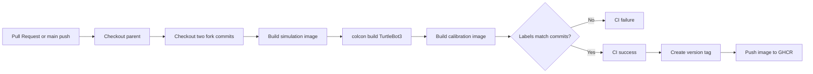

# Simulation PATCH-09: GitHub Actions CI/CD

- 작성일: 2026-08-07
- 브랜치: `feature/github-actions-ci-cd`
- 코드 기준: 상위 repository 최초 commit 전 working tree, `turtlebot3_simulations@45633014a14e8f438495b532a723e4ad45cbbd31`, `direct_visual_lidar_calibration@02a0dc039f5509708f384be4ff3228e0ae09352d`
- 대상: 상위 repository의 Docker·ROS 2 integration build와 GHCR image 배포
- 결론: **첫 CI는 세 repository를 고정 commit으로 checkout해 Docker와 ROS 2 build를 검증한다. CD는 version tag에서 개발환경 image를 GHCR에 게시한다. GUI/GPU Gazebo E2E와 실제 로봇 자동 배포는 제외한다.**

### Why?

현재 상위 repository에는 GitHub Actions workflow가 없다. 로컬의 두 fork는 `.gitignore`로 제외되므로 상위 repository만 GitHub runner에 checkout하면 `forks/` source가 존재하지 않는다.

현재 자동 검증 범위도 build 중심이다. 두 upstream package에는 이 실습이 바로 실행할 unit test가 정의되어 있지 않고, `code/python/`, `code/cpp/` 학습 package는 아직 계획 단계다. 존재하지 않는 test coverage를 CI 성공으로 표현하면 안 된다.

현재 simulation image는 fork source를 image에 복사하지 않는다. Runtime에서 `forks/turtlebot3_simulations`를 bind mount한다. 따라서 registry에 image를 게시해도 수정 source나 완성 application이 자동 배포되는 것은 아니다.

### 개념

| 개념 | 쉬운 설명 | 이 PATCH에서의 역할 |
|---|---|---|
| CI | Pull Request나 commit마다 build와 검사를 자동 실행 | Dockerfile, Compose, ROS 2 source 조합 검증 |
| Continuous Delivery | 검증 결과물을 사람이 선택해 사용할 위치에 자동 게시 | version tag에서 development image를 GHCR에 push |
| Continuous Deployment | 검증 후 운영 장비까지 자동 반영 | 장비 안전·rollback 기준이 없어 이번 범위에서 제외 |
| workflow | `.github/workflows/*.yaml`에 작성하는 자동화 전체 절차 | CI와 image release를 별도 파일로 정의 |
| event | workflow를 시작하는 GitHub 사건 | Pull Request, `main` push, version tag push |
| job | 독립 runner에서 실행되는 작업 묶음 | integration build와 image publish 분리 |
| step | job 안에서 순서대로 실행되는 명령 또는 Action | checkout, build, label 검사 |
| runner | workflow 명령을 실행하는 임시 컴퓨터 | GitHub-hosted Ubuntu runner 사용 |
| artifact | workflow 종료 후 보관하는 log·test 결과 | test가 생긴 뒤 결과 보관 |
| cache | 다음 build에서 재사용할 dependency·Docker layer | build 시간 단축; 배포 결과물은 아님 |
| GHCR | GitHub Container Registry | versioned development image 보관 |

[GitHub Actions 개요](https://docs.github.com/en/actions/get-started/understand-github-actions)에 따르면 workflow는 event로 시작되고 job과 step을 runner에서 실행한다. Workflow 파일은 `.github/workflows/`에 둔다.

### What I Made

이 PATCH는 다음 구현 단계에서 추가할 두 workflow, repository 설정, 검증 범위를 정의한다. 아직 `.github/workflows/` 파일을 생성하거나 GitHub Actions를 실행한 상태는 아니다.

#### 적용 후 구조

```text
# proposed repository layout after Simulation PATCH-09
mobile-robot-calibration-repo/
├── .github/
│   └── workflows/
│       ├── ci.yaml
│       └── release-image.yaml
├── docker/
├── docs/
├── forks/                               # local only
│   ├── turtlebot3_simulations/
│   └── direct_visual_lidar_calibration/
└── patch/
    └── Simulation PATCH-09-github-actions-ci-cd.md
```

#### 전체 흐름



#### 현재 구성과 CI 경계

| 파일 위치 | 함수 또는 설정 | 변경 요약 |
|---|---|---|
| `docker/compose.yaml` | [image build arguments](../../docker/compose.yaml#L5) | 이전: local terminal에서 commit을 수동 전달<br>변경: CI가 checkout한 commit을 build argument로 전달<br>효과: image metadata와 source 조합 자동 확인 |
| `docker/compose.yaml` | [TurtleBot3 bind mount](../../docker/compose.yaml#L29) | 이전: local `forks/`가 있다고 가정<br>변경: workflow가 같은 경로에 fork를 별도 checkout<br>효과: 상위 repository가 source를 추적하지 않아도 build 가능 |
| `docker/sim/Dockerfile` | [commit labels](../../docker/sim/Dockerfile#L3) | 이전: 사람이 label inspect<br>변경: CI가 label과 checkout SHA를 비교<br>효과: `unknown`과 오래된 metadata를 failure 처리 |
| `forks/turtlebot3_simulations/turtlebot3_gazebo/launch/turtlebot3_world.launch.py` | [generate_launch_description()](../../forks/turtlebot3_simulations/turtlebot3_gazebo/launch/turtlebot3_world.launch.py#L29) | 현재: Gazebo server와 GUI client를 함께 시작<br>이번 범위: build만 검증하고 GUI E2E 제외<br>효과: display 없는 runner의 불안정한 GUI 검사를 성공 조건으로 만들지 않음 |

#### Repository별 책임

| Repository | 검사할 내용 | 별도 검사가 필요한 내용 |
|---|---|---|
| 상위 실습 repository | 세 repository 조합, Docker build, Compose, TurtleBot3 overlay build, label | fork의 모든 branch 변화 |
| TurtleBot3 fork | SDF·URDF·bridge·launch·C++ package build와 향후 test | calibration과 결합한 전체 흐름 |
| Calibration fork | calibration image build와 향후 test | TurtleBot3 simulation 결과 |

상위 workflow는 고정한 fork commit만 검사한다. Fork에 새 commit을 push해도 상위 workflow는 자동 시작되지 않는다. 각 fork CI를 통과시킨 뒤 상위 `ci.yaml`의 SHA를 갱신하는 Pull Request로 integration build를 실행한다.

### What was problem

#### 1. 상위 checkout에는 `forks/`가 없음

GitHub runner는 매번 빈 환경에서 시작한다. [actions/checkout의 multiple repository 예시](https://github.com/actions/checkout#checkout-multiple-repos-nested)처럼 `repository`, `ref`, `path`를 지정해야 한다. Calibration repository에는 nested submodule이 있으므로 `submodules: recursive`도 필요하다.

#### 2. branch 이름은 재현 가능한 입력이 아님

`jazzy`와 `main`에는 새 commit이 추가될 수 있다. 같은 상위 commit을 재실행했는데 다른 fork source를 받지 않도록 CI 기본값은 full commit SHA로 고정한다.

#### 3. 현재 성공 조건은 test가 아니라 build

| 성공 항목 | 증명하는 것 | 증명하지 않는 것 |
|---|---|---|
| `docker compose config --quiet` | Compose YAML 해석 가능 | container 실행 성공 |
| simulation image build | Jazzy dependency image 생성 가능 | Gazebo sensor 동작 |
| `colcon build` | TurtleBot3 compile·link 성공 | 회피 알고리즘 정확성 |
| calibration image build | calibration compile·link 성공 | extrinsic 결과 정확성 |
| label comparison | metadata와 checkout commit 일치 | source가 image에 포함됨 |

Simulation PATCH-04와 Simulation PATCH-06의 Python/C++ test가 실제로 추가된 뒤 `colcon test`를 성공 조건에 넣는다.

#### 4. hosted runner는 현재 GUI/GPU 검증 환경이 아님

현재 launch는 Gazebo server의 `-s`와 GUI client의 `-g`를 함께 실행한다. 첫 CI는 compile과 image build만 수행한다. 향후 `gui:=false` 선택을 구현한 뒤 timeout이 있는 headless smoke test를 추가한다. GPU sensor 검증은 신뢰된 self-hosted runner가 필요하며 외부 fork Pull Request code를 그 runner에서 바로 실행하지 않는다.

#### 5. release image는 완성 application bundle이 아님

| 포함 | 미포함 |
|---|---|
| ROS 2 Jazzy Desktop | 수정한 TurtleBot3 source |
| Gazebo Harmonic·`ros_gz` | colcon `install/` 결과 |
| TurtleBot3 binary dependency | calibration source·결과 |
| build 도구와 commit label | 실제 로봇 배포 설정 |

### How it changed

## 1. 시작 조건

상위 repository가 GitHub에 push되고 기본 branch가 `main`이어야 한다. 현재 local 상위 repository는 최초 commit 전이므로 먼저 remote와 최초 commit을 준비한다.

```bash
git status --short
git remote -v
git branch --show-current
```

두 fork는 public repository 기준이다. Private으로 바꾸면 다른 private repository checkout용 최소 권한 token이 별도로 필요하다.

## 2. CI workflow 작성

`.github/workflows/ci.yaml`을 만든다. 2026-08-07 확인 기준 예시는 `actions/checkout@v7`, `docker/setup-buildx-action@v4`, `docker/build-push-action@v7`을 사용한다. 실제 merge 전 repository 정책에 맞게 검증한 full commit SHA로 Action 자체도 pin하는 것을 권장한다.

```yaml
# .github/workflows/ci.yaml | proposed CI workflow
name: CI

on:
  pull_request:
  push:
    branches: [main]
  workflow_dispatch:

permissions:
  contents: read

concurrency:
  group: ci-${{ github.workflow }}-${{ github.ref }}
  cancel-in-progress: true

env:
  DISPLAY: :99
  TB3_SIM_REPOSITORY: JungSeong/turtlebot3_simulations
  TB3_SIM_REF: 45633014a14e8f438495b532a723e4ad45cbbd31
  CALIB_REPOSITORY: JungSeong/direct_visual_lidar_calibration
  CALIB_REF: 02a0dc039f5509708f384be4ff3228e0ae09352d

jobs:
  integration-build:
    runs-on: ubuntu-latest
    timeout-minutes: 90
    steps:
      - name: Checkout lab repository
        uses: actions/checkout@v7
        with:
          persist-credentials: false

      - name: Checkout TurtleBot3 fork
        uses: actions/checkout@v7
        with:
          repository: ${{ env.TB3_SIM_REPOSITORY }}
          ref: ${{ env.TB3_SIM_REF }}
          path: forks/turtlebot3_simulations
          persist-credentials: false

      - name: Checkout calibration fork
        uses: actions/checkout@v7
        with:
          repository: ${{ env.CALIB_REPOSITORY }}
          ref: ${{ env.CALIB_REF }}
          path: forks/direct_visual_lidar_calibration
          submodules: recursive
          persist-credentials: false

      - name: Verify source commits
        run: |
          test "$(git -C forks/turtlebot3_simulations rev-parse HEAD)" = "$TB3_SIM_REF"
          test "$(git -C forks/direct_visual_lidar_calibration rev-parse HEAD)" = "$CALIB_REF"

      - name: Validate Compose
        run: docker compose -f docker/compose.yaml config --quiet

      - name: Set up Docker Buildx
        uses: docker/setup-buildx-action@v4

      - name: Build simulation image
        uses: docker/build-push-action@v7
        with:
          context: docker/sim
          load: true
          push: false
          tags: tb3-jazzy-lab:local
          build-args: |
            TB3_SIM_COMMIT=${{ env.TB3_SIM_REF }}
            CALIB_COMMIT=${{ env.CALIB_REF }}
          cache-from: type=gha,scope=tb3-sim
          cache-to: type=gha,mode=max,scope=tb3-sim

      - name: Build TurtleBot3 overlay
        run: |
          docker compose -f docker/compose.yaml run --rm -T shell bash -lc '
            source /opt/ros/jazzy/setup.bash &&
            colcon build --symlink-install --event-handlers console_direct+
          '

      - name: Build calibration image
        uses: docker/build-push-action@v7
        with:
          context: forks/direct_visual_lidar_calibration
          file: forks/direct_visual_lidar_calibration/docker/jazzy/Dockerfile
          load: true
          push: false
          tags: direct-visual-lidar-calibration:ci
          labels: lab.direct_visual_lidar_calibration.commit=${{ env.CALIB_REF }}
          cache-from: type=gha,scope=calibration-jazzy
          cache-to: type=gha,mode=max,scope=calibration-jazzy

      - name: Verify image labels
        run: |
          TB3_LABEL=$(docker image inspect tb3-jazzy-lab:local \
            --format '{{index .Config.Labels "lab.turtlebot3_simulations.commit"}}')
          CALIB_LABEL=$(docker image inspect tb3-jazzy-lab:local \
            --format '{{index .Config.Labels "lab.direct_visual_lidar_calibration.commit"}}')
          test "$TB3_LABEL" = "$TB3_SIM_REF"
          test "$CALIB_LABEL" = "$CALIB_REF"

      - name: Remove Compose volumes
        if: always()
        run: docker compose -f docker/compose.yaml down --volumes
```

[GitHub cache 문서](https://docs.github.com/en/actions/reference/workflows-and-actions/dependency-caching)가 경고하듯 cache에는 token이나 credential을 넣지 않는다. Cache miss는 속도 차이일 뿐 CI 실패가 아니다.

## 3. CI 결과와 branch protection

| Step | 성공 기준 | 실패 시 확인 |
|---|---|---|
| Checkout forks | 지정 SHA와 nested submodule checkout | 공개 여부, SHA 오타 |
| Validate Compose | exit code 0 | 상대 경로, YAML, 변수 |
| Build simulation image | image 생성 | apt·rosdep network, package 이름 |
| Build TurtleBot3 overlay | `colcon build` exit code 0 | dependency, CMake, compile error |
| Build calibration image | Docker build 성공 | nested dependency, Ceres·GTSAM |
| Verify labels | 두 `test` exit code 0 | stale argument, `unknown`, image tag |

GitHub Settings의 Branches 또는 Rulesets에서 `integration-build`를 `main` merge 필수 check로 지정한다. Workflow가 최소 한 번 실행된 뒤 설정한다.

## 4. CD workflow 작성

이 프로젝트의 첫 CD는 Continuous Delivery다. `v1.0.0` 같은 tag가 push되면 development image를 GHCR에 게시한다. 실제 로봇에 접속하거나 container를 교체하지 않는다.

```yaml
# .github/workflows/release-image.yaml | proposed GHCR workflow
name: Release development image

on:
  push:
    tags: ['v*']

permissions:
  contents: read
  packages: write

env:
  IMAGE_NAME: ghcr.io/jungseong/tb3-jazzy-lab
  TB3_SIM_REF: 45633014a14e8f438495b532a723e4ad45cbbd31
  CALIB_REF: 02a0dc039f5509708f384be4ff3228e0ae09352d

jobs:
  publish:
    runs-on: ubuntu-latest
    timeout-minutes: 60
    environment: release
    steps:
      - uses: actions/checkout@v7
        with:
          persist-credentials: false

      - name: Log in to GHCR
        uses: docker/login-action@v4
        with:
          registry: ghcr.io
          username: ${{ github.actor }}
          password: ${{ secrets.GITHUB_TOKEN }}

      - name: Set up Docker Buildx
        uses: docker/setup-buildx-action@v4

      - name: Build and push versioned image
        uses: docker/build-push-action@v7
        with:
          context: docker/sim
          push: true
          tags: ${{ env.IMAGE_NAME }}:${{ github.ref_name }}
          build-args: |
            TB3_SIM_COMMIT=${{ env.TB3_SIM_REF }}
            CALIB_COMMIT=${{ env.CALIB_REF }}
          cache-from: type=gha,scope=tb3-sim
          cache-to: type=gha,mode=max,scope=tb3-sim
```

[GitHub Docker image 게시 문서](https://docs.github.com/en/actions/tutorials/publish-packages/publish-docker-images)는 같은 repository의 GHCR 게시에 `GITHUB_TOKEN`과 `packages: write`를 사용한다. 별도 PAT를 만들지 않는다.

Settings → Environments에서 `release`를 만들고 필요하면 required reviewer와 tag 제한을 설정한다. [GitHub environment 문서](https://docs.github.com/en/actions/reference/workflows-and-actions/deployments-and-environments)는 publish job 전에 승인과 branch·tag 제한을 적용할 수 있음을 설명한다.

## 5. Release 실행과 확인

```bash
git switch main
git pull --ff-only
git tag -a v0.1.0 -m "v0.1.0"
git push origin v0.1.0
```

Workflow 성공 후:

```bash
docker pull ghcr.io/jungseong/tb3-jazzy-lab:v0.1.0

docker image inspect ghcr.io/jungseong/tb3-jazzy-lab:v0.1.0 \
  --format 'TB3={{index .Config.Labels "lab.turtlebot3_simulations.commit"}} CALIB={{index .Config.Labels "lab.direct_visual_lidar_calibration.commit"}}'
```

같은 version tag를 다른 image에 재사용하지 않는다. 수정본은 `v0.1.1`처럼 새 tag로 게시한다.

## 6. Security 설정

| 항목 | 적용 | 이유 |
|---|---|---|
| 기본 permission | `contents: read` | CI의 source 수정과 package publish 차단 |
| Release permission | 해당 workflow만 `packages: write` | GHCR push 범위만 추가 |
| Action reference | full commit SHA 권장 | 이동 가능한 tag의 supply-chain 위험 축소 |
| Fork Pull Request | `pull_request`, secret 미사용 | untrusted code에 credential 미제공 |
| `pull_request_target` | build에 사용하지 않음 | write token context에서 PR code 실행 방지 |
| self-hosted runner | trusted branch와 수동 실행으로 제한 | host 장치·credential 보호 |

[GitHub Actions 설정 문서](https://docs.github.com/en/repositories/managing-your-repositorys-settings-and-features/enabling-features-for-your-repository/managing-github-actions-settings-for-a-repository)는 Action을 full-length SHA에 pin하도록 강제하는 정책을 제공한다. [GitHub의 `pull_request_target` 보안 문서](https://docs.github.com/en/actions/reference/security/securely-using-pull_request_target)는 해당 event에서 untrusted PR code를 checkout해 실행하지 말라고 경고한다.

Fork Pull Request에는 Actions secret이 전달되지 않는다. CI는 public source checkout과 build만 수행해 secret 없이 통과해야 한다. Release는 tag push와 `GITHUB_TOKEN`을 사용하므로 PR workflow와 분리한다.

## 7. 이후 test 확장

| 구현 단계 | 추가할 CI | 저장할 artifact |
|---|---|---|
| Simulation PATCH-04 Python/C++ extrinsic | transform parity와 quaternion test | `colcon test-result --verbose` |
| Simulation PATCH-06 Python/C++ avoidance | 동일 LaserScan fixture의 command parity | test result XML |
| headless launch 지원 | timeout이 있는 Gazebo server smoke test | launch log·topic snapshot |
| calibration fixture 확정 | 작은 bag의 regression | `calib.json`·error summary |

[GitHub artifact 문서](https://docs.github.com/en/actions/concepts/workflows-and-actions/workflow-artifacts)에 따라 artifact는 build·test 결과 보관용이다. Docker layer처럼 재사용 속도를 위한 데이터는 cache를 사용한다.

## 완료 조건

- [ ] 상위 repository가 GitHub에 push되고 기본 branch가 `main`이다.
- [ ] CI가 두 fork의 full commit SHA를 checkout한다.
- [ ] Calibration checkout에 `submodules: recursive`가 있다.
- [ ] Pull Request에서 Compose validation과 두 Docker build가 성공한다.
- [ ] TurtleBot3 overlay의 `colcon build`가 성공한다.
- [ ] Simulation image label이 checkout commit과 일치한다.
- [ ] `integration-build`가 `main`의 required check다.
- [ ] Release workflow만 `packages: write`를 가진다.
- [ ] `v*` tag에서 GHCR versioned image가 게시된다.
- [ ] GHCR image가 fork source를 포함하지 않는 development image라고 명시한다.
- [ ] GUI/GPU E2E와 실제 로봇 deployment를 CI 성공으로 표현하지 않는다.

## 이 PATCH에서 하지 않는 것

- 실제 로봇에 SSH로 접속해 container 자동 교체
- NVIDIA GPU 또는 `/dev/dri`가 필요한 hosted-runner test
- GUI Gazebo·RViz screenshot test
- test 없는 package에 가짜 `colcon test` 성공 조건 추가
- large rosbag을 Git repository나 Actions cache에 저장
- `latest` tag를 version tag와 함께 무조건 덮어쓰기

첫 구현은 build 재현성과 versioned development image delivery까지만 담당한다. Runtime image와 hardware deployment는 rollback·health check·장비 접근 정책이 정의된 뒤 별도 PATCH로 만든다.
